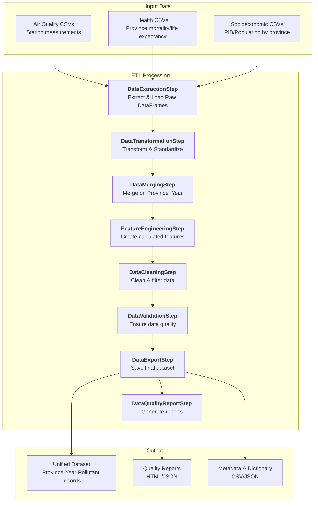
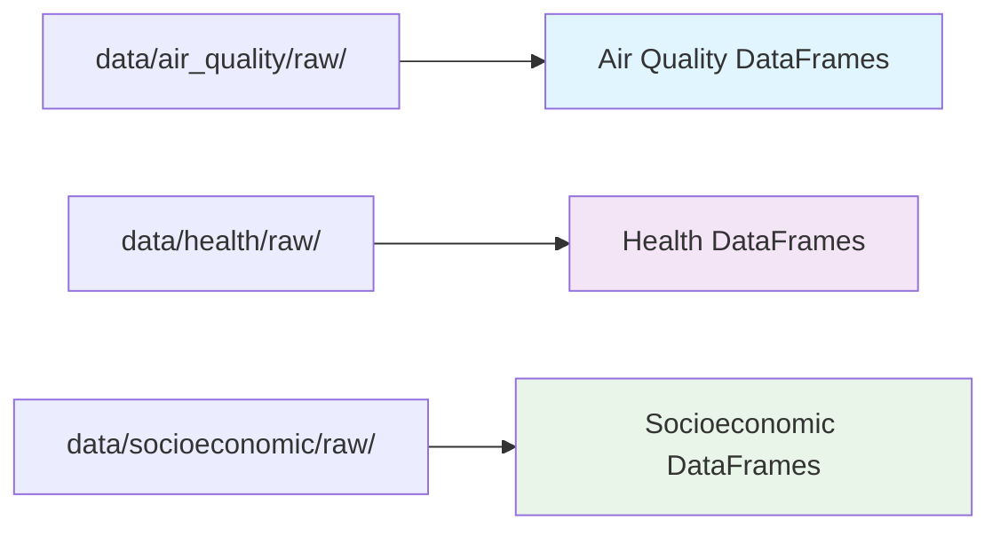
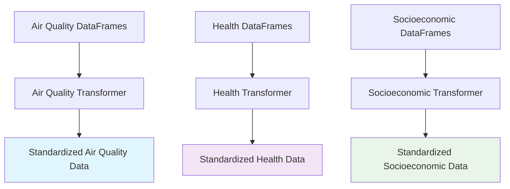
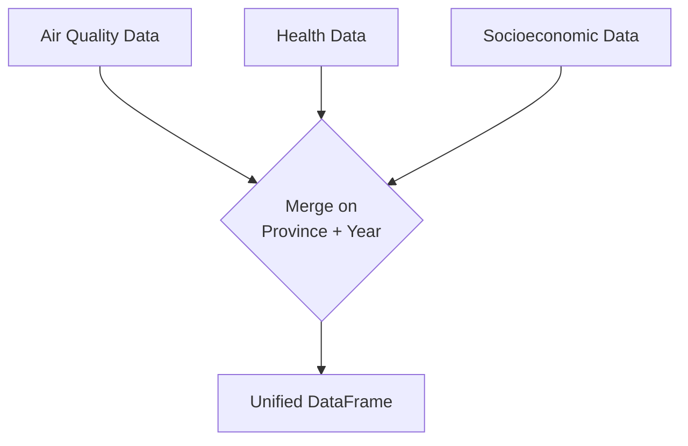
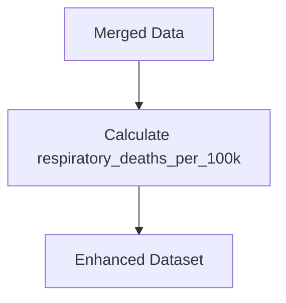
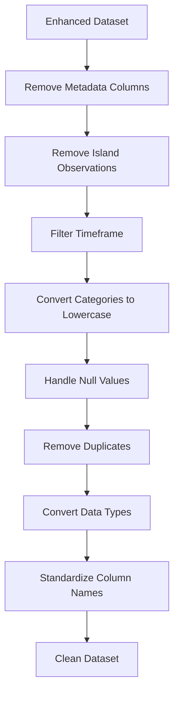
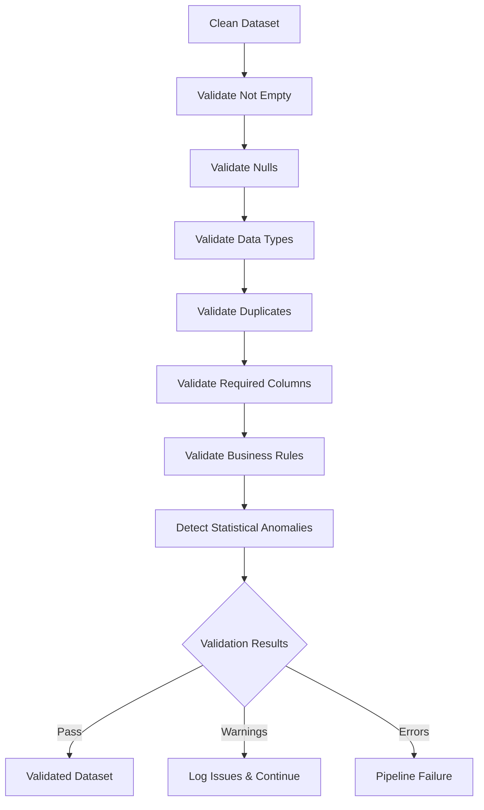
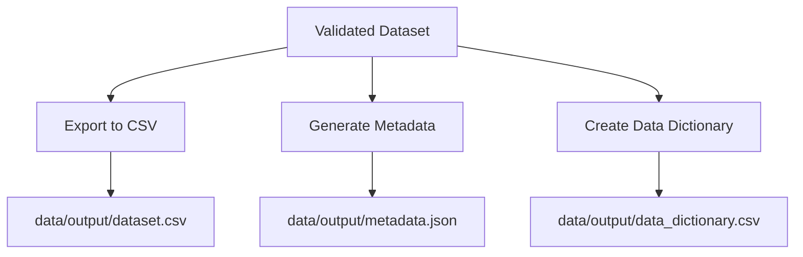
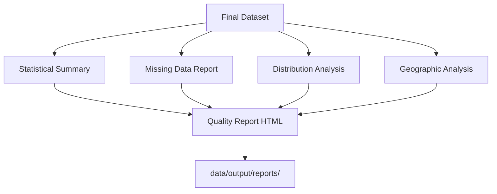

# ETL Pipeline Documentation

The ETL (Extract, Transform, Load) pipeline processes raw data from multiple sources into a unified dataset suitable for machine learning analysis.

## Overview

The pipeline processes data from three main sources:

- **Air Quality Data**: Pollutant measurements with station metadata
- **Health Data**: Respiratory disease mortality and life expectancy statistics
- **Socioeconomic Data**: GDP (PIB) and population data

All data covers Spanish provinces from 2000-2021 and is transformed into a single, clean dataset.

## Pipeline Architecture & Data Flow

The pipeline follows a modular design with 8 sequential steps, each inheriting from the `ETLStep` base class:

<div align="center">



</div>

## ETL Steps in Detail

### 1. DataExtractionStep
**Purpose**: Read raw CSV files from different data sources

<div align="center">



</div>

- Loads CSV files from `data/{source}/raw/` directories
- Creates separate DataFrames for each data source
- Performs initial data type detection and basic validation

### 2. DataTransformationStep
**Purpose**: Transform and standardize data from each source

<div align="center">



</div>

**Key transformations:**

- **Air Quality**: 
    - Clean invalid Province values
    - Classify air quality levels using pollutant thresholds

- **Health**: 
    - Rename columns (Provincias→Province, Periodo→Year, Total→target metrics)
    - Remove commas/dots from respiratory disease totals
    - Convert to numeric types

- **Socioeconomic**: 
    - Transform GDP from wide to long format
    - Rename columns (value→pib, Provincia→Province, anio→Year)
    - Remove dots from population numbers
    - Convert date formats

**Common transformations applied to all sources:**

- Province name standardization using unified mapping system
- Date/year column standardization to consistent format

!!! info "Province Name Standardization"
    Each data source uses different province naming conventions, but Province+Year serves as the primary key for merging. All sources must share identical province names using a unified mapping system.

### 3. DataMergingStep
**Purpose**: Combine all data sources into a single DataFrame

<div align="center">



</div>

**Merge process:**

- Uses Province and Year as composite key
- Maintains air quality station metadata
- Preserves pollutant-specific measurements
- Results in multiple rows per province-year (one per pollutant type)

### 4. FeatureEngineeringStep
**Purpose**: Create new calculated columns

<div align="center">



</div>

**Generated feature:**
- `respiratory_deaths_per_100k`: Calculates respiratory deaths per 100,000 population from respiratory disease totals and population data

### 5. DataCleaningStep
**Purpose**: Clean and filter the dataset

<div align="center">



</div>

**Cleaning operations:**

- Remove metadata columns (e.g., "Total Nacional", "Comunidades y Ciudades Autónomas")
- Remove island observations (excluded regions from configuration)
- Filter timeframe to configured date range
- Convert categorical columns to lowercase (except Province)
- Handle null values (<5% removed, >5% kept for imputation)
- Remove duplicate rows
- Convert columns to appropriate data types from feature_types.yaml
- Standardize column names to lowercase with underscores

### 6. DataValidationStep
**Purpose**: Ensure data quality and integrity

<div align="center">



</div>

**Validation checks:**

- **Not Empty**: Ensure DataFrame has data and rows
- **Nulls**: Check null percentage against configured thresholds
- **Data Types**: Verify columns match feature_types.yaml schema
- **Duplicates**: Detect duplicate rows (configurable allowance)
- **Required Columns**: Ensure all required columns are present
- **Business Rules**: Validate year ranges and positive pollution levels
- **Statistical Anomalies**: Detect outliers using IQR method (>10% triggers warning)

### 7. DataExportStep
**Purpose**: Save the final dataset to storage

<div align="center">



</div>

**Export outputs:**

- Main dataset: `data/output/dataset.csv`
- Metadata file with processing statistics
- Data dictionary with column descriptions
- Processing logs and timestamps

### 8. DataQualityReportStep
**Purpose**: Generate quality reports

<div align="center">



</div>

**Report contents:**

- Descriptive statistics for all variables
- Missing data patterns and percentages
- Pollutant distribution analysis
- Geographic coverage and station distribution
- Data quality scores and recommendations

## Configuration

The pipeline uses YAML configuration files:

- `config/pipeline_config.yaml`: Main pipeline settings
- `utils/unified_province_name.json`: Province name mappings
- `../common/feature_types.yaml`: Feature type definitions

## Error Handling & Recovery

The pipeline includes built-in error recovery mechanisms:

- **Validation warnings**: Continue processing with logged warnings
- **Missing data**: Apply configured imputation strategies  
- **Processing errors**: Retry with alternative approaches
- **Critical failures**: Stop pipeline with detailed error reporting

## Testing

Test suite that covers all pipeline components:

```bash
# Run all ETL tests
pytest tests/

# Run specific test categories
pytest tests/extract_tests/
pytest tests/transform_tests/
pytest tests/load_tests/
```

## Output Dataset Schema

The final dataset contains the following columns:

| Column | Type | Description |
|--------|------|-------------|
| `air_pollutant` | string | Pollutant type (no2, pm25, pm10, so2, o3) |
| `air_pollutant_description` | string | Full pollutant description |
| `data_aggregation_process` | string | How data was aggregated (e.g., "annual mean / 1 calendar year") |
| `year` | date | Measurement year (YYYY-01-01 format) |
| `air_pollution_level` | float | Pollutant concentration value |
| `unit_of_air_pollution_level` | string | Measurement unit (typically μg/m³) |
| `air_quality_station_type` | string | Station type (traffic, background, industrial) |
| `air_quality_station_area` | string | Area type (urban, suburban, rural) |
| `longitude` | float | Station longitude coordinate |
| `latitude` | float | Station latitude coordinate |
| `altitude` | float | Station altitude (meters) |
| `province` | string | Standardized Spanish province name |
| `quality` | string | Data quality classification (buena, etc.) |
| `respiratory_diseases_total` | integer | Total respiratory disease deaths |
| `life_expectancy_total` | float | Life expectancy at birth |
| `pib` | float | PIB (GDP) in billions of euros |
| `population` | integer | Province population |
| `respiratory_deaths_per_100k` | float | Respiratory deaths per 100,000 population |
